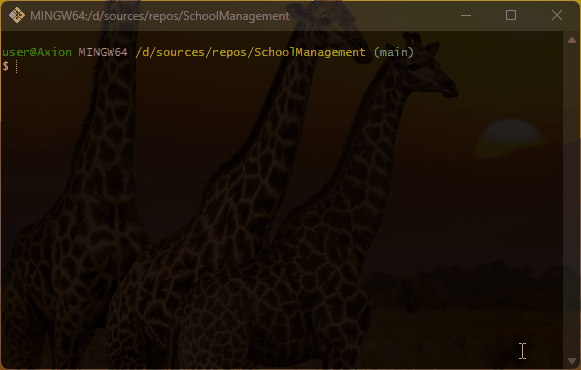

# 🏫 SchoolManagement
Performing CRUD operations on Teacher and Student lists

## 💻 About program
*Sections:*
1. *Add Teacher data, insert random, extract data(all and by id), modify data, delete data*
2. *On Student data:*

- *Add random students*
- *Add students range*
- *Add student*
- *Get all students data (groped by classes)*
- *Get student by ID*
- *Search student by Name*
- *Get student on the page*
- *Get students count*
- *Change student*
- *Delete student*

### 🪟 Preview

### ⚙️ Technologies
 

## 🧑‍💻 I worked on it
- *OOP princples: Abstraction, Encapsulation, Inheritance, Polymorphism*
- *Elements of OOP: classes, objects, interfaces*
- *Classes: Console, Random, user-defined classes*
- *Data types: int, string, bool*
- *Access modifiers: public, private*
- *Collections: Array, List\<T>, Dictionary\<TKey, TValue>*
- *LINQ methods: Where(), FirstOrDefault(), OrderBy(), Contains()GroupBy(), Skip() & Take(), Count(), Remove(), Select()*
- *Strings: Regular, Interpolation*
- *Looping statements: for, do while*
- *Condition statements: if else, switch*
- *Keywords: break, continue, ref*

## 🤝 Future development
- *Change data storage method to constant*
- *Dividing menus according to Student and Teacher roles*